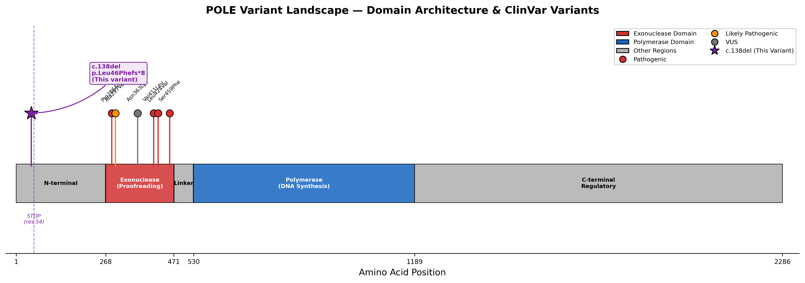
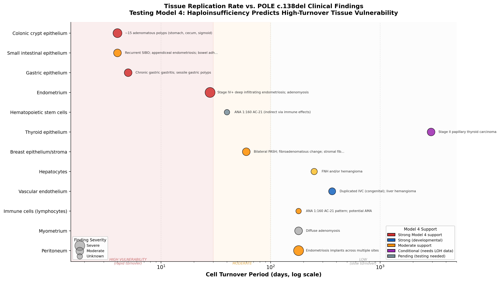
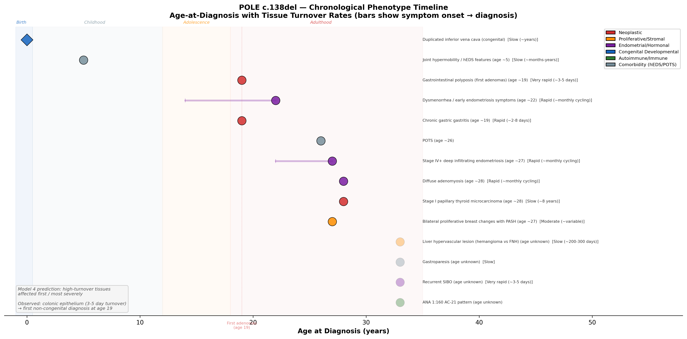

# POLE c.138del (p.Leu46Phefs*8) — Research Framework

> **A novel ultra-rare frameshift variant in DNA Polymerase Epsilon causing Polymerase Proofreading-Associated Polyposis (PPAP) with reported ultra-hypermutated tumor phenotype**

---

## Overview

This repository contains the scientific research framework, clinical documentation, and analysis pipeline specifications for investigating **POLE c.138del (p.Leu46Phefs\*8)** — a pathogenic frameshift variant in the *POLE* gene identified in a female patient with:

- **Reported ultra-hypermutated tumor phenotype** (TMB >100 mutations/Mb; assay platform and source tumor specimen pending clarification — WGS-based TMB determination and mutational signature confirmation are priority experiments)
- **Complex multi-system phenotype** extending beyond classical PPAP: gastrointestinal polyposis (~15 sessile adenomatous polyps), Stage I papillary thyroid carcinoma (1.2 cm, isthmus, encapsulated, non-invasive; outside established PPAP tumor spectrum), Stage IV+ deep infiltrating endometriosis with thoracic diaphragmatic extension and intestinal adhesions, bilateral proliferative breast changes with IHC-confirmed PASH, liver hypervascular lesion (hemangioma vs. FNH), congenital duplicated inferior vena cava, and ANA 1:160 with reticular cytoplasmic AC-21 pattern (associated with anti-mitochondrial antibodies)
- **Complete absence from gnomAD** and all major population databases — despite POLE tolerating heterozygous LoF at the gene level (gnomAD pLI ≈ 0, LOEUF = 0.76; 188 LoF variants observed vs. 279 expected), c.138del itself is absent (0/1,614,586 alleles; [gnomAD v4 query](https://gnomad.broadinstitute.org/gene/ENSG00000177084?dataset=gnomad_r4), GRCh38 chr12:132681203–132681204)
- **Premature protein truncation at ~residue 54** of the 2,286-amino-acid POLE catalytic subunit
- **Sole identified genetic driver among genes tested** — a 47-gene hereditary cancer panel (2022) found no pathogenic variants in APC, MUTYH, MLH1/MSH2/MSH6/PMS2, POLD1, BRCA1/2, TP53, PTEN, or any other tested gene (panel does not cover GREM1 regulatory variants, connective tissue genes, or all structural variation)

This variant presents a **fundamental mechanistic paradox**: it eliminates all major catalytic domains of POLE — including the exonuclease active site (residues 268–471; Church et al., 2013) and the polymerase core (residues ~530–1189; Korona et al., 2011) — yet produces a clinical phenotype indistinguishable from classical PPAP caused by missense variants within the exonuclease active site.

Critically, the phenotype extends beyond neoplasia into **proliferative/stromal dysregulation** (bilateral PASH, liver FNH), **endometrial tissue dysfunction** (severe endometriosis + adenomyosis), a **congenital vascular anomaly** (duplicated IVC), and **potential mitochondrial autoimmunity** (ANA AC-21/AMA) — suggesting that POLE haploinsufficiency affects tissue biology at a systemic, developmental level, not just through tumor mutation accumulation.

**Resolving this paradox has implications beyond this single patient.** It could restructure how POLE truncation variants are classified in clinical genetics, expand the population recognized as carrying cancer predisposition alleles, and open novel therapeutic avenues.

> **Scope and intent:** This is an **n-of-1 hypothesis-generating framework** built around a single index case. The hypotheses, mechanistic models, and therapeutic considerations presented here are derived from one patient's clinical data interpreted against published literature — they are not validated findings. We are seeking collaborators (structural biologists, clinical geneticists, bioinformaticians, immunologists) to help validate these hypotheses in additional POLE truncation carriers and model systems. If you have access to relevant patient cohorts, DepMap data, or experimental infrastructure, see [Contributing](#contributing).

---

## Variant Verification & Methodology

External evaluators need to assess the variant's authenticity and the strength of the underlying data. This section consolidates what is confirmed, what is reported but unverified, and what is pending.

| Item | Status | Detail |
|------|--------|--------|
| **Variant identification** | Confirmed | POLE c.138del (p.Leu46Phefs*8) identified via clinical-grade 47-gene hereditary cancer panel (2022). Heterozygous. Panel platform and laboratory name available on request |
| **Orthogonal confirmation** | Pending | Sanger sequencing or independent NGS confirmation not yet performed. Clinical-grade panel calls are generally high-confidence for indels in well-covered regions, but orthogonal validation is standard for novel variants entering research |
| **TMB >100 mut/Mb** | Reported, unverified | Assay platform, source tumor specimen, and sequencing methodology are pending clarification. WGS-based TMB determination and mutational signature confirmation (SBS10a/b/28) are the highest-priority experiments. Until confirmed, all TMB-dependent claims should be treated as provisional |
| **MSI status** | Not yet tested | Microsatellite instability testing and MMR IHC have not been performed. Required to determine WRN inhibitor relevance and rule out secondary MMR loss |
| **gnomAD absence** | Verified | c.138del absent from gnomAD v4 (0/1,614,586 alleles). Gene-level constraint: pLI ≈ 0, LOEUF = 0.76 (188 observed LoF / 279 expected). Queried via [gnomAD v4 API](https://gnomad.broadinstitute.org/gene/ENSG00000177084?dataset=gnomad_r4) (GRCh38, ENST00000320574). Genomic coordinates: chr12:132681203–132681204 (GRCh38) |
| **Patient demographics** | Female, currently early 30s. Self-reported European ancestry. First clinical finding (polyposis) at age 19 | Full phenotype timeline in [`docs/clinical_case_summary.md`](docs/clinical_case_summary.md) |
| **Family history** | Maternal grandmother: uterine cancer + ductal breast cancer. Father and paternal grandmother unremarkable | Inheritance (de novo vs. maternal) unknown; parental testing recommended |
| **Consent for research** | Patient-directed | This framework is maintained by the patient. Clinical data is self-reported and de-identified. No IRB-approved protocol is currently in place — establishing one is a prerequisite for any collaboration involving biospecimen analysis or prospective data collection |

> **For potential collaborators:** The most productive entry point is the [Research Prioritization Timeline](#research-prioritization-timeline), which ranks experiments by feasibility, impact, and what they resolve. The full clinical phenotype is documented in [`docs/clinical_case_summary.md`](docs/clinical_case_summary.md) with genomic profile, family history, and complete laboratory data.

---

## What We Know vs. What We Don't Know

| Established | Requires Investigation |
|-------------|----------------------|
| **Variant identity:** POLE c.138del (p.Leu46Phefs*8), heterozygous frameshift, premature stop at ~residue 54 | **LOH status:** Has the wild-type POLE allele been somatically lost in tumor tissue? (Paired tumor-normal WGS with ASCAT/FACETS) |
| **Classification: Pathogenic** (clinical laboratory). Cannot be classified under existing POLE-specific guidelines (Mur et al., 2023 — designed for non-disruptive ED missense variants). Independent ACMG evidence assessment: PM2 + PP4 firmly assignable; PVS1 applicability debated (mechanism does not match canonical dominant-negative model). Submitted to [LOVD3](https://databases.lovd.nl/shared/variants/POLE) (2026-04-15, pending curation); ClinVar submission prepared | **Mutational signatures:** Are canonical POLE signatures (SBS10a/b/28) present, or does a non-canonical process drive the ultra-hypermutation? |
| **Tumor phenotype:** Reported TMB >100 mut/Mb (assay platform and source specimen pending clarification) — clinically consistent with PPAP | **NMD escape:** Does the mutant mRNA escape nonsense-mediated decay? What is the mutant:WT transcript ratio? |
| **47-gene panel negative:** No pathogenic variants in APC, MUTYH, MMR genes, POLD1, BRCA1/2, TP53, PTEN, or any other tested gene — POLE c.138del is the sole identified genetic driver among genes tested (panel does not cover GREM1 regulatory variants, connective tissue genes, or all structural variation) | **Mechanism:** Which of the 6 candidate models (LOH, reinitiation, holoenzyme poisoning, haploinsufficiency, isoform-specific, second-site somatic mutation) explains the paradox? |
| **Five-category phenotype:** Neoplastic + proliferative/stromal + endometrial + congenital developmental + autoimmune/immune | **AMA confirmation:** Does the ANA AC-21 pattern reflect true anti-mitochondrial antibodies? (AMA-specific ELISA for anti-PDC-E2) |
| **gnomAD constraint:** pLI ≈ 0, LOEUF = 0.76 — POLE tolerates heterozygous LoF (188 observed LoF in gnomAD; [gnomAD v4](https://gnomad.broadinstitute.org/gene/ENSG00000177084?dataset=gnomad_r4)); implies haploinsufficiency alone insufficient for PPAP cancer phenotype | **Thyroid POLE signatures:** Does the thyroidectomy specimen carry SBS10a/b, formally expanding the PPAP tumor spectrum? |
| **ANA AC-21 pattern:** Reticular cytoplasmic staining at 1:160, associated with anti-mitochondrial antibodies | **Normal tissue mutation rate:** Is the somatic mutation rate elevated in non-tumor cells? (Duplex sequencing / NanoSeq on PBMCs) |
| **Congenital anomaly:** Duplicated IVC — cannot be explained by somatic mechanisms, argues for germline-level effect | **Reinitiation products:** Does translational reinitiation at downstream AUGs (e.g., M497, M530) produce truncated POLE protein? (Ribo-seq, proteomics) |
| **Comorbidity triad:** hEDS/POTS/gastroparesis — creates therapeutic constraints and potential phenotype modifiers | **MCAS status:** Does the patient have mast cell activation syndrome? (Tryptase, urinary PGD2 metabolites) — if present, chronic inflammation may amplify POLE-driven tumorigenesis |

---

## Table of Contents

- [Variant Verification & Methodology](#variant-verification--methodology)
- [What We Know vs. What We Don't Know](#what-we-know-vs-what-we-dont-know)
- [Clinical Presentation](#clinical-presentation)
  - [Comparison with Classical PPAP Cohort](#comparison-with-classical-ppap-cohort)
  - [Comorbidity Context: hEDS/POTS/Gastroparesis Triad](#comorbidity-context-hedspotsgastroparesis-triad)
- [The Mechanistic Paradox](#the-mechanistic-paradox)
- [POLE Domain Architecture](#pole-domain-architecture)
- [Candidate Mechanistic Models](#candidate-mechanistic-models)
- [How Clinical Findings Constrain Mechanistic Models](#how-clinical-findings-constrain-mechanistic-models)
- [Tissue Vulnerability Analysis](#tissue-vulnerability-analysis)
- [Novel Research Questions](#novel-research-questions)
- [Endometriosis × POLE Intersection](#endometriosis--pole-intersection)
- [Mutational Signature Discrimination](#mutational-signature-discrimination)
- [Blood-Based Research Assays](#blood-based-research-assays)
- [Therapeutic Strategy](#therapeutic-strategy)
- [Experimental Models Required](#experimental-models-required)
- [Research Prioritization Timeline](#research-prioritization-timeline)
- [Key Literature References](#key-literature-references)
- [Repository Structure](#repository-structure)
- [Clinical Significance Statement](#clinical-significance-statement)
- [Contributing](#contributing)
- [License](#license)

**Additional resources:** [Clinical Case Summary](docs/clinical_case_summary.md) | [Systematic Health History](docs/systematic_health_history.md) | [POLE Carrier Registry Cross-Reference](docs/pole_carrier_registry_crossref.md) | [Comorbidity Interaction Analysis](docs/comorbidity_interaction_analysis.md) | [Pharmacokinetic Considerations](therapeutics/pharmacokinetic_considerations.md) | [POLE-Endometriosis Hypothesis](docs/endometriosis_hypothesis/) | [Formal Hypotheses & Falsification Criteria](models/mechanistic_models.md) | [Temporal Correlation Analysis](analysis/temporal_phenotype/temporal_correlation_analysis.ipynb) | [GA4GH Phenopacket](data/phenopacket/pole_c138del_phenopacket.json) | [ClinVar Submission](data/clinvar_submission/) | [AI Research Assistance Framework](docs/AI-Research-Assistance-Framework.md) | [FAQ](FAQ.md) | [Changelog](CHANGELOG.md) | [Cite This Repository](CITATION.cff)

---

## Clinical Presentation

The patient's phenotype spans five distinct categories — neoplastic, proliferative/stromal, endometrial/hormonal, congenital developmental, and autoimmune/immune — suggesting POLE dysfunction affects tissue biology at a systemic level, not just through tumor mutation accumulation. For full clinical detail, see [`docs/clinical_case_summary.md`](docs/clinical_case_summary.md).

### Neoplastic Findings (Classical PPAP Spectrum)

| Finding | Details | PPAP Relevance |
|---------|---------|----------------|
| **Gastrointestinal polyposis** | Progressive adenomatous polyposis: ~6 adenomas at first colonoscopy (age 19), accumulating to ~15+ across surveillance at ages 21, 24, 27, 29, ~31 (stomach, cecum, sigmoid colon); chronic gastric gastritis | First non-congenital finding at age 19 — consistent with Model 4 prediction that fastest-dividing tissue (colonic epithelium, 3–5 day turnover) is affected first. Progressive accumulation indicates ongoing mutagenesis. Consistent with attenuated PPAP (Palles et al. 2022) |
| **Stage I papillary thyroid carcinoma** | 1.2 cm, isthmus, encapsulated, non-invasive. Cystic variant with extensive squamous metaplasia. AJCC 8th ed T1bN0M0 (patient <55 years). Associated adenomatoid nodular hyperplasia | **Not part of established PPAP tumor spectrum.** If SBS10a/b signatures or POLE LOH are confirmed, would formally expand the recognized PPAP phenotype. Encapsulated/non-invasive phenotype notable |

### Proliferative and Stromal Findings

| Finding | Details | Significance |
|---------|---------|-------------|
| **Bilateral proliferative breast changes with PASH** | Biopsy (2020): columnar cell change, cystic/papillary apocrine metaplasia, stromal fibrosis, focal PASH. IHC: CD34+, CK AE1/AE3− (confirms PASH). Left: fibroadenomatous change with dense stromal fibrosis | IHC-confirmed PASH; bilateral stromal proliferative dysregulation — pattern suggests a **field effect** rather than focal lesion |
| **Liver hypervascular lesion (hemangioma vs. FNH)** | Segment VII, subcapsular, 16 × 14 mm. Peripheral hypervascular in arterial phase, isodense venous phase, no washout. Associated splenoportal arteriovenous shunt | Combined with IHC-confirmed PASH, duplicated IVC, and arteriovenous shunt — reveals a pattern of **vascular/stromal proliferative abnormalities across multiple organ systems** |

### Endometrial/Hormonal Findings

| Finding | Details | Significance |
|---------|---------|-------------|
| **Stage IV+ deep infiltrating endometriosis** | Trans-diaphragmatic penetration (abdominal → thoracic surface); bilateral ovarian endometriomas (5cm R, 2cm L); uterosacral ligament nodules; retroperitoneal fibrosis with ureteral encasement requiring ureterolysis; ascending colon/bowel adhesions; appendiceal endometriosis (histology-confirmed); posterior cul-de-sac implants; pelvic free fluid | rASRM Stage IV (severe) with extrapelvic extension. Diaphragmatic endometriosis occurs in an estimated 0.6–1.5% of endometriosis patients overall (Nezhat et al., 2019), though estimates vary widely due to diagnostic difficulty; full-thickness trans-diaphragmatic invasion is rarer still. Pelvic free fluid likely secondary to peritoneal inflammation |
| **Diffuse asymmetric adenomyosis** | Endometrial tissue invading the myometrium; caused severe menorrhagia requiring regular iron infusions and causing syncope; necessitated ovarian-sparing total hysterectomy (~28) | Combined with endometriosis, indicates systemic endometrial tissue dysregulation; severity requiring surgical intervention underscores aggressive endometrial phenotype |
| **Recurrent SIBO and gastric dysmotility** | Small intestinal bacterial overgrowth; gastric dysmotility requiring medication | May result from bowel adhesions, chronic peritoneal inflammation, and convergence of endometriotic and polyposis GI involvement |

> The endometrium is among the most POLE-vulnerable tissues (endometrial cancer is a major PPAP malignancy; somatic POLE mutations occur in 7–13% of sporadic endometrial cancers). The simultaneous presence of superficial peritoneal lesions, deep infiltrating nodules, and ovarian endometriomas across distant anatomical sites is consistent with oligoclonal dissemination of mutant clones (Anglesio et al., NEJM 2017; Lac et al., 2022). If POLE haploinsufficiency increases the per-division error rate in endometrial stem cells, it would generate more clones with proliferative and invasive advantages — predicting more severe endometriosis in germline POLE carriers. This connection has **never been investigated**. See [`docs/endometriosis_hypothesis/`](docs/endometriosis_hypothesis/) for the full hypothesis document with testable predictions.

### Congenital Developmental Finding

| Finding | Details | Significance |
|---------|---------|-------------|
| **Duplicated inferior vena cava** | Congenital vascular anomaly present from embryonic development | **Cannot be explained by somatic mutations or tumor-related processes.** Robinson et al. (2021) demonstrated germline POLE mutations affect mutation rates during embryogenesis. This suggests POLE haploinsufficiency may have **developmental consequences** — arguing against the pure LOH model (Model 1) as the sole explanation. **Base rate context:** Duplicated IVC occurs in 0.6–2.6% of the general population (Coco et al., 2019; Bass & Redwine, 2010), so this finding alone could be coincidental — its significance derives from co-occurrence with other vascular/stromal findings |

### Autoimmune/Immune Findings

| Finding | Details | Significance |
|---------|---------|-------------|
| **ANA 1:160, AC-21 pattern** | Reticular cytoplasmic pattern (ICAP AC-21), characteristically associated with anti-mitochondrial antibodies (AMA targeting PDC-E2 on the inner mitochondrial membrane) | May represent immune recognition of mitochondrial antigens exposed through POLE-driven dysfunction of nuclear-encoded mitochondrial proteins. Warrants AMA-specific ELISA confirmation. **Base rate context:** ANA positivity at 1:160 occurs in ~5–15% of healthy women (Satoh et al., 2012; Mariz et al., 2011); however, the specific AC-21 reticular cytoplasmic pattern is uncommon in healthy populations and is strongly associated with AMA/PBC |

> The AC-21 finding provides serological evidence for a mitochondrial stress pathway: POLE haploinsufficiency → elevated mutations in ~1,500 nuclear-encoded mitochondrial genes → impaired mitochondrial protein function → membrane perturbation and antigen exposure → AMA production. This connects to the patient's liver FNH/hemangioma (AMA are the serological hallmark of primary biliary cholangitis) and to the broader pattern of innate immune activation, as mitochondrial DAMPs (mtDNA, cardiolipin, formylated peptides) activate TLR9 and NLRP3 inflammasome pathways. No study has examined AMA rates in POLE/POLD1 carriers — this finding generates the testable prediction that autoantibody profiling should be part of systematic POLE carrier phenotyping. See full clinical detail in [`docs/clinical_case_summary.md`](docs/clinical_case_summary.md).

### Comorbidity Context: hEDS/POTS/Gastroparesis Triad

The patient's phenotype must be interpreted in the context of co-occurring **hypermobile Ehlers-Danlos syndrome (hEDS)**, **postural orthostatic tachycardia syndrome (POTS)**, and **gastroparesis** — a recognized clinical triad that interacts with POLE-driven pathology at multiple levels:

- **MCAS as potential modifier:** The hEDS/POTS/gastroparesis triad frequently co-occurs with mast cell activation syndrome (MCAS). If present, chronic mast cell-derived mediators (histamine, cytokines, tissue edema) could create a **pro-tumorigenic microenvironment** that amplifies POLE-driven cancer predisposition through angiogenesis promotion, local immune suppression, and altered epithelial turnover rates.
- **Immune profiling implications:** Autonomic dysfunction directly modulates immune function via the vagus nerve (a major neuroimmune regulatory pathway). POTS-related immune baseline alterations create genuine uncertainty about whether published ICI response rates (POLE signature ≥78.5% predicting response) translate directly to this patient.
- **Therapeutic constraints:** ATR/CHK1 inhibitors cause autonomic side effects and nausea — potentially catastrophic with pre-existing POTS and gastroparesis. Oral drug bioavailability is inherently unreliable with gastroparesis. ICI agents can cause autoimmune colitis and autonomic neuropathy as irAEs, both difficult to detect against pre-existing dysautonomia and GI dysmotility. See [`therapeutics/`](therapeutics/) for detailed risk assessment.
- **Computational modeling:** The proposed digital twin model should incorporate parameters for altered crypt geometry and replicative stress from connective tissue abnormality (hEDS-related ECM changes), not just POLE dosage alone.

See [`docs/clinical_case_summary.md`](docs/clinical_case_summary.md) for full comorbidity context, modifier assessment framework, and MCAS evaluation protocol.

### Disentangling POLE-Attributable vs. hEDS-Attributable Phenotypes

Several clinical findings in this patient could be attributed to either POLE haploinsufficiency or hEDS, creating a confounding problem that must be explicitly addressed:

| Finding | POLE Attribution | hEDS Attribution | Distinguishing Approach |
|---------|-----------------|-----------------|------------------------|
| **Stage IV+ endometriosis** | POLE haploinsufficiency elevates mutation rate in endometrial stem cells → more clones with invasive potential | hEDS causes altered ECM, increased tissue laxity, and chronic inflammation → more permissive environment for endometrial implantation | Endometriotic lesion sequencing: if SBS10a/b signatures present, POLE contribution confirmed |
| **GI dysmotility / gastroparesis** | POLE-driven polyposis and mucosal inflammation | hEDS-associated autonomic dysfunction and visceral hypermobility | GI motility studies + polyp-independent symptom assessment |
| **Bilateral PASH** | POLE-driven stromal proliferative field effect | hEDS alters stromal collagen architecture; PASH may be more common in connective tissue disorders | Histologic review: collagen ultrastructure vs. CD34+ stromal proliferation pattern |
| **Liver vascular lesion** | POLE-associated vascular/stromal proliferation | FNH/hemangioma prevalence similar in general population (~0.03–0.3% for FNH) | Could be coincidental; significance derives from co-occurrence pattern |
| **Severe menorrhagia** | POLE-driven endometrial dysfunction (adenomyosis) | hEDS causes impaired hemostasis, vascular fragility | Pre-hysterectomy histology review for mutation signatures |

**Key insight:** hEDS alone could plausibly explain the severe endometriosis (through altered ECM and chronic peritoneal inflammation), GI dysmotility, and some vascular findings. The features most likely attributable to POLE include the progressive adenomatous polyposis, thyroid carcinoma, ultra-hypermutated TMB, and potentially the specific pattern of endometrial tissue becoming malignancy-adjacent (adenomyosis severe enough to require hysterectomy). Molecular testing (mutational signature analysis of endometriotic and breast tissue) is the definitive approach to disentangle these overlapping phenotypes.

### Pattern Across Findings

The phenotype spans **neoplastic** (polyps, thyroid carcinoma), **proliferative/stromal** (breast PASH, liver FNH/hemangioma), **endometrial** (severe endometriosis, adenomyosis), **congenital developmental** (duplicated IVC), and **autoimmune/immune** (ANA AC-21, potential anti-mitochondrial antibodies) domains, with additional comorbidity context from the hEDS/POTS/gastroparesis/potential MCAS triad. This breadth transforms the case from an interesting mechanistic puzzle into a multi-system phenotype with implications for PPAP spectrum expansion, endometriosis biology, mitochondrial immunology, developmental genetics, and neuroimmune interactions.

### Comparison with Classical PPAP Cohort

How this patient compares to published PPAP cohort data (Palles et al. 2022, Bellido et al. 2016, Valle et al. 2020):

| Feature | Classical PPAP (Published Cohorts) | This Patient (c.138del) | Concordance |
|---------|-----------------------------------|------------------------|-------------|
| **Variant type** | Missense substitution in exonuclease active site | Frameshift (p.Leu46Phefs*8) — premature stop at residue 54 | **Novel** |
| **Affected domain** | Exonuclease domain (residues 268–471) | N-terminal region (upstream of all functional domains) | **Novel** |
| **Inheritance** | Autosomal dominant (heterozygous) | Heterozygous (de novo vs. inherited unknown) | Concordant |
| **Polyp count** | 10–100 adenomatous polyps (attenuated) | ~15 sessile adenomatous polyps | Concordant |
| **Polyp distribution** | Colorectal predominant; gastric in POLE carriers | Stomach, cecum, sigmoid colon | Concordant |
| **GI features** | Chronic gastritis reported in some POLE carriers | Chronic gastric gastritis; diffuse GI mucosal changes; recurrent SIBO | Concordant |
| **Cancer types** | Colorectal, endometrial, ovarian, brain — N363K extends PPAP spectrum to glioblastoma (Vande Perre et al., 2019; Labrousse et al., 2023) | Papillary thyroid carcinoma (Stage I, 1.2 cm, isthmus, encapsulated) | **Expands spectrum** |
| **TMB** | Ultra-hypermutated (>100 mut/Mb) with SBS10a/b | Reported TMB >100 mut/Mb (assay platform and source specimen pending clarification; WGS + signature confirmation pending) | Concordant (if confirmed) |
| **Extra-GI neoplastic** | Endometrial cancer (most common); occasional brain, ovarian | Thyroid carcinoma (not previously in PPAP spectrum) | **Expands spectrum** |
| **Non-neoplastic proliferative** | Not systematically reported | Bilateral PASH, liver FNH/hemangioma | **Novel** |
| **Congenital anomalies** | Not reported in any PPAP cohort | Duplicated inferior vena cava | **Novel** |
| **Endometriosis** | Not reported in any PPAP cohort | Stage IV+ deep infiltrating endometriosis with thoracic extension | **Novel** |
| **Autoimmune features** | Not reported in any PPAP cohort | ANA 1:160 with AC-21 pattern (anti-mitochondrial antibodies) | **Novel** |
| **Connective tissue/dysautonomia** | Not reported in any PPAP cohort | hEDS, POTS, gastroparesis — potential MCAS | **Novel** |
| **Mechanism** | Dominant-negative gain of function (error-blind polymerase) | Unknown — 6 candidate models under investigation | **Novel** |

> **Key insight:** This patient is fully concordant with classical PPAP for neoplastic features (polyp count, distribution, TMB) while simultaneously presenting five categories of findings never reported in any PPAP cohort. This suggests that current PPAP phenotyping may be systematically underascertaining non-neoplastic manifestations, or that the truncating variant mechanism produces a broader phenotype than exonuclease-domain missense variants.

---

## The Mechanistic Paradox

### Classical PPAP Mechanism

Canonical PPAP-causing variants (P286R, V411L, L424V, S459F) are **missense substitutions** clustered within the exonuclease active site. Their mechanism is a **dominant-negative gain of function**: the polymerase retains DNA synthesis capability (sometimes with increased processivity) but loses proofreading function. The yeast pol2-P301R allele (equivalent to human P286R) has a **50-fold higher mutator effect** than the exonuclease-inactive pol2-4 allele (D290A,E292A), demonstrating that P286R does more than simply inactivate proofreading — it actively increases error rates beyond what loss of exonuclease alone would produce (Kane & Shcherbakova, 2014; Parkash et al., 2019, *Nat Commun*). The result is a hyperactive, error-blind polymerase that outcompetes mismatch repair, producing ultra-hypermutation with characteristic COSMIC mutational signatures **SBS10a** (C>A in TCT), **SBS10b** (C>T in TCG), and **SBS28**.

**Critically, canonical ExoD missense drivers operate without LOH** — tumor genomic profiles do not show loss of the wild-type POLE allele (Barbari & Shcherbakova, 2019). The heterozygous mutant allele is sufficient for ultra-hypermutation. This makes the LOH hypothesis for the c.138del truncation variant (Model 1) **mechanistically distinct** from classical PPAP, not derivative of it.

### Why This Variant Should Not Cause PPAP

> **Literature consensus acknowledgment:** The current scientific consensus does **not** support truncating POLE variants as pathogenic for PPAP. All established pathogenic PPAP variants are missense substitutions in the exonuclease domain that produce a dominant-negative, error-prone polymerase. Truncating variants are generally considered non-pathogenic for PPAP because they cannot produce the gain-of-function mechanism. Furthermore, gnomAD population data shows that POLE tolerates heterozygous LoF (pLI ≈ 0, LOEUF = 0.76; 188 LoF variants observed), and Andrianova et al. (2024, *Eur J Hum Genet*) demonstrated that heterozygous polymerase proofreading variants cause only ~15% mutation rate increase with cancer requiring somatic LOH — a recessive, not dominant, predisposition model. This framework investigates whether the c.138del variant represents a novel, non-canonical pathogenic mechanism (LOH-dependent, haploinsufficiency-mediated, or other) that has not been previously recognized in PPAP — a hypothesis, not an established finding.

The variant **p.Leu46Phefs\*8** terminates the protein at approximately residue 54 — over **200 amino acids upstream** of the exonuclease domain. Under orthodox models:

1. **Haploinsufficiency should be insufficient.** The wild-type allele should produce normal functional POLE. A 50% reduction in protein output should not produce TMB >100 mut/Mb. gnomAD confirms this: 188 LoF carriers exist without apparent PPAP.
2. **Complete POLE loss is embryonic lethal.** Homozygous *Pole* knockout is lethal at embryonic day 7 in mice ([MGI:1196391](https://www.informatics.jax.org/marker/MGI:1196391)); hemizygous *Pole*^P286R/null mice are essentially embryonic lethal (<5% expected offspring; Barbari & Shcherbakova, 2019).
3. **Yet the phenotype is clinically consistent with PPAP.** Reported TMB >100 mut/Mb with polyposis and multi-system involvement matches the PPAP clinical presentation — though molecular confirmation (SBS10a/b/28 mutational signatures) is pending.

---

## POLE Domain Architecture

```
POLE Catalytic Subunit (p261; 2,286 aa, 261 kDa)

|===|         |========|=============|    |=======================|              |======================|
 1-54          223-----268----------471    ~530-------------------1189             1189----------------2286
  ↑            Broader  Exonuclease        Polymerase core                        C-terminal regulatory
  STOP         ExoD     active site        (palm + fingers + thumb)               (POLE2/3/4 binding,
  p.Leu46      region   (P286R, V411L,     (DNA synthesis)                         CMG helicase interaction)
  Phefs*8               L424V, S459F)

  ■ Truncated peptide   ■ Classical PPAP   ■ Polymerase activity                  ■ Accessory subunit
    (no catalytic          driver variants    (140 kDa N-terminal                    binding & regulation
    function)                                 catalytic fragment)
```

**Domain convention notes:** Two boundary conventions appear in the literature. The **narrow exonuclease active site** (residues 268–471) is the region screened for PPAP driver mutations (Church et al., 2013, *HMG*; Campbell et al., 2017, *Cell*). The **broader exonuclease-containing region** (residues 223–517) includes flanking structural elements ([Atlas of Genetics and Oncology](https://atlasgeneticsoncology.org/gene/41773/pole-(dna-polymerase-epsilon-catalytic-subunit))). The catalytic fragment corresponds to the N-terminal 140 kDa portion (residues 1–1189), which retains full polymerase and exonuclease activity *in vitro* (Korona et al., 2011, *JBC*). Domain architecture follows Liu & Linn (2000, *NAR*): N-terminal region (1–267), core catalytic domain (268–1189), C-terminal regulatory domain (1189–2286).

The truncation at residue 54 eliminates all catalytic domains — no exonuclease activity, no polymerase activity, no C-terminal regulatory regions. Note: the N-terminal region (residues 1–54) may participate in CMG helicase complex interactions and DNA binding (Parkash et al., 2019; UniProt Q07864), so the truncated 54-residue peptide is not necessarily inert (see Model 3). Structured reference data (domain boundaries, coding sequence, constraint metrics) is available in [`data/`](data/) for programmatic analysis.



---

## Candidate Mechanistic Models

Six non-mutually-exclusive models could resolve the paradox. **Discriminating between them is the central research priority.**

> **Classification framework context:** The definitive gene-specific ACMG/AMP classification guidelines for POLE/POLD1 variants (Mur, Viana-Errasti, García-Mulero et al., *Genome Medicine* 2023) were designed for **non-disruptive (missense) variants within the exonuclease domain**. The c.138del variant — a truncating variant upstream of the exonuclease domain — falls entirely outside the scope of that framework. Resolving the mechanistic paradox below would necessitate extending the classification guidelines to accommodate truncating variants acting through LOH, reinitiation, or haploinsufficiency mechanisms.

For formal hypotheses with specific falsifiable predictions and exclusion criteria for each model, see [`models/mechanistic_models.md`](models/mechanistic_models.md).

### Model 1: Somatic Loss of Heterozygosity (LOH)

The wild-type POLE allele is somatically deleted or silenced in tumor tissue (via deletion, copy-neutral LOH through mitotic recombination, or promoter methylation). Cells with no functional POLE rely on lower-fidelity compensatory polymerases (e.g., Polδ). This follows **Knudson's two-hit tumor suppressor model** rather than the dominant-negative paradigm.

**Key experiment:** Paired tumor-normal WGS with allele-specific copy number analysis (ASCAT/FACETS).

**If confirmed:** Reclassifies POLE as operating under a tumor-suppressor paradigm for truncating variants. Truncating POLE variants currently classified as VUS may need reclassification as pathogenic.

### Model 2: Translational Reinitiation

Ribosomes encountering the premature stop codon reinitiate at a downstream AUG codon. If reinitiation occurs between the exonuclease and polymerase domains, the resulting N-terminally truncated protein retains polymerase activity but lacks proofreading — **phenocopying the canonical dominant-negative mechanism** through a completely different genetic route.

**Key experiment:** Ribosome profiling (Ribo-seq) to map translating ribosomes across the mutant POLE transcript. Candidate reinitiation sites with Kozak context scores are catalogued in [`data/POLE_downstream_methionines.tsv`](data/POLE_downstream_methionines.tsv) — notably M497 and M530 (both with moderate-to-strong Kozak contexts) would produce polymerase-only proteins lacking proofreading, directly phenocopying dominant-negative PPAP.

**Prior probability: Low.** Efficient reinitiation across >1 kb of coding sequence (M497 is ~1.3 kb downstream) would be unprecedented in standard mammalian mRNAs (Sherlock et al., 2023). Formally testable but considered unlikely absent positive Ribo-seq evidence.

### Model 3: NMD Escape + Holoenzyme Poisoning

The premature termination codon escapes nonsense-mediated mRNA decay. The truncated 54-amino-acid peptide retains partial binding capacity for the POLE2 (p59) accessory subunit, competitively inhibiting holoenzyme assembly — a **dominant-negative through stoichiometric poisoning** rather than catalytic dysfunction.

**Key experiments:** Allele-specific RNA-seq (NMD escape test); co-immunoprecipitation of synthetic 54-residue peptide with recombinant POLE2.

**Prior probability: Low.** The POLE–POLE2 interaction interface is mediated by the C-terminal domain (~residues 1,265–2,286), not the N-terminus (Yuan et al., 2020; He et al., 2024). A 54-residue peptide competing with full-length wild-type POLE for POLE2 binding is structurally implausible without experimental evidence to the contrary.

### Model 4: Replication Stress-Dependent Haploinsufficiency

50% POLE dosage is adequate under normal conditions but **rate-limiting under replicative stress** in rapidly dividing tissues (colonic crypts, endometrium). This would demonstrate that POLE proofreading operates closer to a **threshold** than a linear dose-response.

**Key experiment:** Duplex sequencing (NanoSeq) on normal blood cells and colonic epithelium vs. age-matched controls.

### Model 5: Isoform-Specific Effects

The c.138del differentially affects alternative POLE transcript variants — eliminating a catalytically critical isoform while sparing others or producing aberrant isoform-specific truncated products with neomorphic properties.

**Key experiment:** Isoform-specific RT-PCR and proteomics across multiple tissues.

### Model 6: Second-Site Somatic POLE Mutation

A somatic pathogenic missense mutation arises on the **wild-type** POLE allele within the exonuclease domain (e.g., P286R, V411L), converting it into a canonical dominant-negative, error-prone polymerase. Unlike Model 1 (LOH), the wild-type allele is not lost — it acquires a gain-of-function mutation. This is biologically plausible: somatic POLE exonuclease domain mutations occur in 7–13% of sporadic endometrial cancers and ~3% of CRC. If Model 4 (haploinsufficiency) elevates the baseline mutation rate, the probability of somatically hitting a POLE hotspot is correspondingly increased. Shah et al. (2024) documented co-occurring POLE exonuclease and non-exonuclease domain mutations affecting TMB.

**Key experiment:** Paired tumor-normal WGS with **phased variant calling** to determine whether any somatic POLE variant is in trans (on the wild-type allele) vs. in cis (on the already-truncated allele).

---

## How Clinical Findings Constrain Mechanistic Models

The patient's multi-system phenotype provides immediate discriminatory evidence even before experimental results. See [`models/mechanistic_models.md`](models/mechanistic_models.md) for the complete discriminatory power matrix.

| Finding | M1 (LOH) | M2 (Reinitiation) | M3 (Poisoning) | M4 (Haplo.) | M5 (Isoform) | M6 (Second-site) |
|---------|----------|-------------------|----------------|-------------|-------------|------------------|
| **Duplicated IVC (congenital)** | Cannot explain (LOH is somatic) | Neutral | Neutral | Supports (germline developmental effect) | Neutral | Cannot explain (somatic event) |
| **Stage IV+ endometriosis** | Neutral | Neutral | Neutral | Supports (high-turnover tissue threshold) | Possible | Neutral |
| **Bilateral PASH + liver FNH** | Unlikely (multi-organ, non-neoplastic) | Neutral | Neutral | Supports (systemic stromal/vascular proliferation) | Neutral | Unlikely (multi-organ) |
| **Thyroid carcinoma** | Possible (organ-specific LOH) | Possible | Neutral | Supports (high mitotic rate gland) | Possible | Possible (organ-specific) |
| **GI polyposis** | Possible | Possible | Possible | Supports (high-turnover epithelium) | Possible | Possible |
| **ANA AC-21 (AMA)** | Neutral | Neutral | Neutral | Supports (mitochondrial stress from systemic mutagenesis) | Neutral | Neutral |

The **congenital duplicated IVC** is the single most important clinical discriminator — it cannot be explained by any somatic mechanism (Models 1–3) and provides direct evidence for a germline-level effect (Model 4). However, duplicated IVC occurs in 0.6–2.6% of the general population, so its significance rests on the co-occurrence with other vascular/stromal proliferative findings rather than as an isolated observation. The **ANA AC-21 pattern** (anti-mitochondrial antibodies) adds a new dimension: if POLE haploinsufficiency elevates mutation rates in nuclear-encoded mitochondrial genes (~1,500 genes), the resulting mitochondrial dysfunction could expose inner membrane antigens to immune surveillance, producing AMA. Note that ANA positivity at ≥1:160 occurs in ~5–15% of healthy women, but the specific AC-21 reticular cytoplasmic pattern is uncommon in healthy populations and strongly associated with PBC. The multi-system non-neoplastic findings (PASH, FNH, severe endometriosis, potential AMA) collectively argue against Model 1 operating alone, as independent LOH in each organ would be an extraordinary coincidence.

### Current Leading Theory (Updated 2026-04-17)

> **This section is maintained as a living assessment and should be updated as new data enters the repository or new research is published.**

**Primary model: Model 4 — Replication Stress-Dependent Haploinsufficiency**

Model 4 currently has the strongest clinical support among all six candidates. The evidence favoring it:

1. **Congenital duplicated IVC** — A developmental anomaly present from embryogenesis cannot be caused by somatic LOH or any other post-zygotic mechanism. This finding alone eliminates Models 1–3 as sole explanations and provides direct evidence for germline-level POLE dysfunction affecting embryonic development.
2. **Tissue turnover–onset age correlation** — The temporal sequence of diagnoses correlates with tissue cell division rates: colonic epithelium (3–5 day turnover) → adenomas by age 19; endometrium (monthly) → symptoms by ~22; thyroid (~8-year turnover) → carcinoma by ~28. This gradient is a hallmark prediction of dosage-dependent, replication-coupled mutagenesis (Spearman ρ > 0, p < 0.05; see [`analysis/temporal_phenotype/`](analysis/temporal_phenotype/)).
3. **Progressive polyp accumulation** — New adenomas at every surveillance interval over >12 years (ages 19→21→24→27→29→31) indicates ongoing constitutive mutagenesis, not a single clonal event.
4. **Multi-system non-neoplastic phenotype** — Bilateral PASH, liver hypervascular lesion, severe endometriosis/adenomyosis, dysplastic nevus, splenoportal arteriovenous shunt, and ANA AC-21 pattern collectively indicate systemic tissue dysregulation that cannot be explained by organ-specific somatic events.
5. **Absence of FILS/neurodevelopmental features** — The patient lacks features seen in biallelic POLE mutations (FILS syndrome, intellectual disability), confirming that one functional allele is sufficient for CNS development but insufficient for genomic fidelity in high-turnover tissues — a tissue-specific haploinsufficiency pattern.

**Secondary model: Model 1 — Somatic LOH (complementary, not alternative)**

Model 1 likely operates in parallel with Model 4 to explain the tumor-specific ultra-hypermutation (reported TMB >100 mut/Mb). The thyroid carcinoma — arising in a slow-cycling tissue where haploinsufficiency alone may be insufficient — is best explained by somatic loss of the wild-type allele in that specific tissue. Pending experiment: paired tumor-normal WGS with allele-specific copy number analysis.

**What would change this assessment:**
- If NanoSeq on normal blood cells shows completely normal mutation rates → weakens Model 4, strengthens Model 1 as primary
- If tumor WGS shows no LOH at the POLE locus → eliminates Model 1 for that tumor
- If Ribo-seq detects downstream ribosome reinitiation → Model 2 rises to primary/co-primary
- If maternal grandmother's POLE testing shows the variant is inherited → strengthens Model 4 (multi-generational penetrance data)

---

## Tissue Vulnerability Analysis

Model 4 (replication stress-dependent haploinsufficiency) predicts that tissues with the highest cell division rates should be most vulnerable to POLE haploinsufficiency. The following visualization tests this prediction against the patient's clinical findings:



**Key observation:** The patient's most severe findings (GI polyposis, Stage IV+ endometriosis) occur in the fastest-cycling tissues (colonic crypts every 3–5 days, endometrium monthly), consistent with Model 4's prediction. The thyroid carcinoma — arising in a slow-cycling tissue (~8 years) — is the notable exception, suggesting either that LOH (Model 1) drives tumorigenesis in slow-cycling tissues, or that tissue-specific factors beyond division rate modulate vulnerability.

The temporal phenotype map below shows age-at-onset by phenotype category, with tissue turnover rates annotated:



The congenital duplicated IVC (earliest onset) and childhood-onset hEDS features provide the strongest evidence for constitutive, germline-level POLE dysfunction. Structured data underlying these figures is available in [`data/tissue_replication_rates.tsv`](data/tissue_replication_rates.tsv) and [`data/phenotype_timeline.tsv`](data/phenotype_timeline.tsv).

---

## Novel Research Questions

The clinical phenotype generates questions beyond the six mechanistic models. Each hypothesis is rated by confidence level:

- **Supported** — At least one direct data point from this case plus biological plausibility
- **Plausible** — Consistent with known biology; no direct evidence against, but also no direct evidence for
- **Speculative** — Interesting but requires significant validation; alternative explanations exist

| # | Hypothesis | Confidence | Rationale for Rating |
|---|-----------|------------|---------------------|
| 1 | **Does POLE haploinsufficiency contribute to endometriosis severity?** | **Supported** | Direct evidence: Stage IV+ endometriosis in a POLE carrier; endometrium is high-turnover, POLE-vulnerable tissue; endometriosis affects ~10% of reproductive-age women. *Confound: hEDS independently causes severe endometriosis (see below)* |
| 2 | **Should thyroid cancer be added to the PPAP tumor spectrum?** | **Supported** | Direct evidence: Stage I PTC in this POLE carrier; thyroid not previously in PPAP spectrum. Contingent on confirming POLE signatures in thyroidectomy specimen |
| 3 | **Do POLE truncation carriers have elevated rates of congenital anomalies?** | **Speculative** | Single observation: duplicated IVC in one carrier. Base rate 0.6–2.6% in general population; could be coincidental. Requires cohort-level data from POLE carrier registries |
| 4 | **Are bilateral stromal proliferative changes (PASH, FNH) a feature of systemic POLE dysfunction?** | **Plausible** | Pattern of vascular/stromal proliferation across breast and liver suggests field effect, but these findings are individually common (PASH ~23% of breast biopsies; FNH prevalence ~0.03–0.3%) |
| 5 | **Do POLE carriers have elevated rates of anti-mitochondrial antibodies?** | **Speculative** | Single observation: ANA AC-21 in one carrier. Mechanistic logic is compelling (POLE mutagenesis → mitochondrial gene dysfunction → antigen exposure), but ANA 1:160 occurs in ~5–15% of healthy women; the specific AC-21 pattern is more informative but still n=1 |
| 6 | **Do other POLE truncation carriers show non-neoplastic multi-system phenotypes?** | **Plausible** | The 6 LoF variants identified by Valle et al. (2020) in 2,813 probands are the critical comparator set. Retrospective phenotyping is feasible and would be definitive |
| 7 | **Does POLE haploinsufficiency affect telomere maintenance?** | **Speculative** | POLE interacts with the shelterin complex; haploinsufficiency could affect telomere replication fidelity. No direct evidence from this case; testable via telomere length analysis in patient cells |
| 8 | **Does POLE haploinsufficiency affect immune cell development?** | **Speculative** | POLE is essential for all proliferating cells including lymphocyte expansion; haploinsufficiency could subtly alter immune repertoire development. No direct evidence; testable via deep immune profiling |

See [`docs/pole_carrier_registry_crossref.md`](docs/pole_carrier_registry_crossref.md) for the full cross-reference analysis and proposed collaborative study.

---

## Endometriosis × POLE Intersection

### The Testable Prediction

Endometriosis is a disease of somatically mutant clonal expansion. Anglesio et al. (*NEJM* 2017) demonstrated that 79% of deep infiltrating endometriotic lesions harbor cancer-driver mutations (ARID1A, KRAS, PIK3CA) — acquired somatically in endometrial epithelial cells that then disseminate to ectopic sites. Lac et al. (2022) showed that anatomically distant lesions share identical mutations, confirming oligoclonal dissemination. Suda et al. (2018) mapped clonal architecture revealing progressive diversification.

If POLE haploinsufficiency elevates the per-division mutation rate in endometrial stem cells (Model 4), it should **increase the probability of acquiring these driver mutations per stem cell division**. This generates a specific, testable prediction: **endometriotic lesions from a germline POLE carrier should show elevated somatic mutation burden — and potentially POLE mutational signatures (SBS10a/b) — above the baseline somatic mutation rates documented by Anglesio et al.** The endometrium is among the most POLE-vulnerable tissues: somatic POLE mutations define an entire molecular subtype of endometrial cancer (7–13% of sporadic cases; TCGA 2013), and endometrial cancer is a hallmark PPAP malignancy.

### Why This Case Is Informative

This patient presents Stage IV+ deep infiltrating endometriosis with features that are unusual even for severe disease:

- **Trans-diaphragmatic penetration** — full-thickness invasion from abdominal to thoracic surface (estimated 0.6–1.5% of endometriosis patients; Nezhat et al., 2019)
- **Multi-compartment involvement** — bilateral ovarian endometriomas, uterosacral ligament nodules, retroperitoneal fibrosis with ureteral encasement, appendiceal endometriosis (histology-confirmed), bowel adhesions
- **Severity requiring surgical intervention** — ovarian-sparing total hysterectomy at ~28 for refractory adenomyosis with menorrhagia causing syncope

The co-occurrence of hEDS creates a genuine confound — hEDS independently associates with severe endometriosis through altered ECM and chronic peritoneal inflammation (see [Disentangling POLE vs. hEDS](#disentangling-pole-attributable-vs-heds-attributable-phenotypes)). **Molecular testing is the definitive discriminator**: if endometriotic lesion tissue shows SBS10a/b signatures or elevated mutation burden with POLE-characteristic trinucleotide context, the POLE contribution is confirmed regardless of the hEDS confound.

### Tissue Collection Opportunity

An upcoming endometriosis-related surgery provides a prospective opportunity to collect fresh tissue for:

1. **Whole-exome or whole-genome sequencing** of endometriotic lesion epithelium vs. matched normal (peritoneal surface or blood) — primary endpoint: somatic mutation burden and mutational signature decomposition (SBS10a/b/28 vs. background)
2. **Targeted sequencing** for known endometriosis driver mutations (ARID1A, KRAS, PIK3CA) with variant allele frequency quantification — to determine whether the number and diversity of driver clones exceeds published rates
3. **Single-cell sequencing** of lesion epithelium — to map clonal architecture and determine whether POLE haploinsufficiency produces a broader clonal diversity than typical endometriosis
4. **Paired LOH analysis at the POLE locus** — if the wild-type allele is lost in endometriotic tissue, it would demonstrate that LOH can occur in non-malignant proliferative lesions, a finding with major implications for the haploinsufficiency vs. LOH model debate

This would be the **first study of somatic mutation burden in endometriosis from a germline DNA polymerase proofreading-deficient carrier** — a natural experiment that cannot be replicated in model systems. Fresh tissue banking under an appropriate research protocol (IRB approval required) is essential; FFPE significantly degrades mutation calling sensitivity.

See [`docs/endometriosis_hypothesis/`](docs/endometriosis_hypothesis/) for the full hypothesis document with detailed testable predictions and proposed collaborator framework.

---

## Mutational Signature Discrimination

Mutational signature analysis is the most immediately actionable discriminator between mechanisms.

### Scenario A: Canonical POLE Signatures Present

| Sig | Context | Interpretation |
|-----------|---------|----------------|
| SBS10a | C>A in TCT | POLE proofreading failure confirmed |
| SBS10b | C>T in TCG | Mechanism converges on same biochemical deficiency |
| SBS28 | Secondary | Supports reinitiation or LOH model |

**Implication:** Despite early truncation, the ultra-hypermutation arises from POLE proofreading failure. Strongly favors Models 1 or 2.

### Scenario B: Non-Canonical Signatures

| Signature | Context | Interpretation |
|-----------|---------|----------------|
| SBS6/15/21/26 | MMR deficiency | Different mutational process |
| SBS2/13 | APOBEC activity | Non-POLE mechanism |
| Novel | Uncharacterized | Redefines PPAP boundaries |

**Implication:** A fundamentally different mutational process drives the hypermutation. Would redefine what PPAP is as a syndrome.

### Required Analysis

```
Pipeline: WGS ≥60x tumor / ≥30x normal → SigProfiler decomposition → COSMIC SBS10a/b/28 quantification
Tools: SigProfilerExtractor (de novo), SigProfilerAssignment (reference-based), MutationalPatterns, deconstructSigs
LOH: ASCAT/FACETS + Battenberg/HATCHet (recommended for hypermutated tumors)
Reference: COSMIC v3.4 mutational signatures
```

See detailed pipeline specifications: [`analysis/mutational_signatures/`](analysis/mutational_signatures/) | [`analysis/loh_analysis/`](analysis/loh_analysis/) | [`analysis/duplex_sequencing/`](analysis/duplex_sequencing/) | [`analysis/neoantigen_prediction/`](analysis/neoantigen_prediction/)

**Published evidence (Annals of Oncology, 2024):** POLE signature contribution ≥78.5% predicts ICI response; ≤28.5% associated with non-response. This makes signature analysis both a mechanistic and clinical priority.

---

## Blood-Based Research Assays

Blood tests represent the most accessible experimental approach, spanning genomic, proteomic, immune, and metabolic domains.

### Genomic & Mutational

| Assay | Purpose | Key Output |
|-------|---------|------------|
| **Duplex Sequencing / NanoSeq** on PBMCs | Measure somatic mutation rate in normal cells vs. age-matched controls | If SBS10a/b elevated: haploinsufficiency pathogenic. If normal: LOH model confirmed |
| **Allele-specific RNA-seq** | Determine if mutant mRNA escapes NMD | Mutant:WT transcript ratio |
| **CHIP profiling** (DNMT3A, TET2, ASXL1, TP53) | Assess clonal hematopoiesis burden | Elevated CHIP for age = indirect evidence of elevated mutation rate |
| **Germline WGS** | Identify co-occurring pathogenic variants | Comprehensive modifier assessment |

> **The single highest-yield blood test:** Duplex sequencing / NanoSeq on PBMCs. The 2021 Nature Genetics study (Robinson et al.) demonstrated this approach can detect elevated SBS10a/b in normal tissues of germline POLE carriers. The 2025 NanoSeq protocol achieves <5 errors per billion bp with whole-exome compatibility.

### Circulating Tumor Markers

| Assay | Purpose | Platform Examples |
|-------|---------|-------------------|
| **Tumor-informed ctDNA** | Monitor residual disease, recurrence, tumor evolution | Signatera, FoundationOne Tracker, Guardant Reveal |
| **CTC isolation + single-cell WGS** | Track tumor genomic diversity without biopsy | Monitor for secondary MMR mutations |

### Immune Profiling

| Assay | Purpose | Clinical Relevance |
|-------|---------|-------------------|
| **CyTOF / spectral flow cytometry** | Map T cell subsets, exhaustion markers (PD-1, TIM-3, LAG-3, TIGIT) | Predict ICI response; guide mono vs. dual checkpoint |
| **TCR repertoire sequencing** (immunoSEQ) | Identify expanded tumor-reactive clones | Longitudinal immune surveillance biomarker |
| **Neoantigen-reactive T cell detection** | Peptide-MHC multimer quantification | Gold standard for immunogenicity confirmation |
| **Cytokine profiling** (Olink/Luminex) | IFN-γ, TNF-α, CXCL9, CXCL10 | Elevated CXCL9/10 predicts ICI efficacy |

### Autoantibody & Mitochondrial

| Assay | Purpose | Clinical Relevance |
|-------|---------|-------------------|
| **AMA-specific ELISA** (anti-PDC-E2, anti-BCOADC-E2, anti-OGDC-E2) | Confirm whether AC-21 pattern reflects true AMA; identify target antigen | Diagnostic for subclinical PBC; connects POLE mutagenesis to mitochondrial immune targeting |
| **Liver function panel** (GGT, alkaline phosphatase) | Assess biliary function given hepatic vascular lesions + potential AMA | PBC screening in context of liver FNH/hemangioma |
| **Extended autoimmune panel** (anti-dsDNA, ENA, complement C3/C4, anti-smooth muscle) | Determine whether ANA positivity is isolated to AC-21 or indicates broader immune dysregulation | Comprehensive autoimmune profiling |
| **Mitochondrial function** (Seahorse XF, MitoSOX ROS) | Measure OCR, ECAR, and mitochondrial ROS in patient-derived cells | Direct evidence of mitochondrial dysfunction from nuclear-encoded gene mutagenesis |

### Protein & Metabolic

| Assay | Purpose | Method |
|-------|---------|--------|
| **POLE protein quantification** | Measure wild-type POLE levels; detect aberrant products | SRM/PRM mass spectrometry on PBMCs |
| **dNTP pool quantification** | Detect nucleotide imbalance compounding proofreading deficit | LC-MS/MS (dATP, dCTP, dGTP, dTTP) |

---

## Therapeutic Strategy

> **Clinical context:** The patient does **not** currently have active advanced malignancy. The thyroid carcinoma was treated (total thyroidectomy, Stage I, no recurrence), and gastrointestinal polyps are under surveillance with regular endoscopic removal. This section is **prospective contingency planning** — mapping therapeutic options in the event that a POLE-driven malignancy develops that requires systemic treatment, or evaluating whether preventive strategies (chemoprevention, preventive immunotherapy) have sufficient evidence to consider. The synthetic lethality targets below are mechanistic hypotheses requiring preclinical validation in POLE-null model systems before clinical consideration; they are not current treatment recommendations. See also the [POLE-null vs. POLE-mutant distinction](therapeutics/synthetic_lethality.md#critical-distinction-pole-mutant-vs-pole-null) — all published synthetic lethality data derives from POLE-ExoD-mutant cells, not the POLE-null state expected in this patient's LOH-driven tumors.

### Immunotherapy

| Approach | Rationale | Evidence | Evidence Level |
|----------|-----------|----------|----------------|
| **Anti-PD-1 (pembrolizumab)** | Reported TMB >100 mut/Mb (pending WGS confirmation); FDA tissue-agnostic approval at ≥10 | Pathogenic POLE: 82.4% CBR, 15.1 mo PFS, 29.5 mo OS (JCO Precision Oncology, 2022) | **FDA-approved** (tissue-agnostic) |
| **Anti-PD-1 + anti-CTLA-4** | If multiple co-inhibitory receptors expressed | CheckMate-142 precedent in MSI-H CRC | **Phase III** (in MSI-H; extrapolated to POLE) |
| **Neoantigen vaccination** | Extreme neoantigen load; adjuvant post-resection | mRNA-4157/V940 platform; combination with ICI | **Phase II/III** (general; no POLE-specific data) |
| **Preventive ICB** | Pre-cancer checkpoint blockade in PPAP carriers | Delayed tumor onset in polymerase mutator mice; ICB did NOT improve survival in established tumors; 32.5% vs. 2.7% responder rate (Sawant et al., 2025) | **Preclinical only** (mouse; hypothesis-generating) |

### Synthetic Lethality Targets

| Target | Drug Candidates | Rationale | Stage | Evidence Level |
|--------|----------------|-----------|-------|----------------|
| **ATR-CHK1** | Ceralasertib, Berzosertib, Elimusertib | POLE-deficient cells near viability threshold for replication stress; ATR inhibition causes replication catastrophe | Phase I/II | **Preclinical + Phase I/II** (ATR-POLE synthetic lethality shown in cell lines; clinical trials in DDR-deficient tumors, not POLE-specific) |
| **WRN helicase** | WRN inhibitors | If secondary MMR loss creates MSI, WRN is essential for fork stability at expanded microsatellites | Preclinical | **Preclinical** (WRN dependency validated in MSI-H cell lines; conditional on this tumor acquiring secondary MMR loss) |
| **PARP trapping** | Olaparib, Talazoparib | Replication stress may increase dependence on PARP1-mediated fork stabilization | Phase II | **Phase II** (PARP inhibitors approved for BRCA; POLE-specific synthetic lethality is mechanistic extrapolation) |
| **WEE1 kinase** | Adavosertib (AZD1775) | WEE1 inhibition forces premature mitotic entry with unrepaired DNA damage; synergizes with replication stress | Phase I/II | **Phase I/II** (clinical activity in DDR-deficient tumors; no POLE-specific data) |
| **CDK4/6** | Palbociclib, Ribociclib, Abemaciclib | G1/S checkpoint inhibition combined with replication stress may selectively kill POLE-deficient cells | Phase I (combination) | **Phase I** (combination rationale; CDK4/6 inhibitors approved for breast cancer) |
| **dNTP metabolism** | Brequinar (DHODH), low-dose HU | Nucleotide imbalance compounds proofreading deficit; may push mutation rate beyond viability | Experimental | **Experimental** (theoretical rationale; no POLE-specific preclinical data) |
| **ATR + PARP** | AZD6738 + Olaparib | ATR inhibition causes HRR deficiency, synergizing with PARP trapping | Phase I/II | **Phase I/II** (combination trials in DDR-deficient tumors; synergy demonstrated in cell lines) |

### Surveillance & Prevention

- Expanded multi-organ surveillance beyond standard PPAP protocol
- ctDNA monitoring for molecular-level recurrence detection
- Aspirin chemoprevention (biological rationale from CAPP2 trial in Lynch syndrome; n-of-1 design). **Dose note:** The CAPP2 dose (600 mg) carries significant GI risk given gastroparesis and gastric polyposis; 81 mg may be safer (CaPP3 trial comparing doses)
- Reproductive genetic counseling with PGT-M, acknowledging penetrance uncertainty

See detailed strategies: [`therapeutics/immunotherapy_strategy.md`](therapeutics/immunotherapy_strategy.md) | [`therapeutics/synthetic_lethality.md`](therapeutics/synthetic_lethality.md) | [`therapeutics/surveillance_protocol.md`](therapeutics/surveillance_protocol.md) | [`therapeutics/pharmacokinetic_considerations.md`](therapeutics/pharmacokinetic_considerations.md)

> **Comorbidity-adjusted drug selection:** The patient's gastroparesis makes oral drug absorption unreliable, and POTS amplifies autonomic side effects. The [pharmacokinetic considerations document](therapeutics/pharmacokinetic_considerations.md) maps each candidate agent to route of administration, comorbidity interactions, and feasibility — **IV pembrolizumab** is the highest-priority agent (strong efficacy data + bypasses GI absorption), while oral ATR/PARP inhibitors carry significant feasibility concerns.

---

## Experimental Models Required

| Model | Timeline | Purpose |
|-------|----------|---------|
| **Patient-derived organoids** (tumor + normal) | 3–6 months | Drug screening (ICI in immune co-culture, ATR/PARP/WRN inhibitors); mutational signature dynamics; LOH timing |
| **Isogenic CRISPR cell lines** | 6–12 months | Engineer c.138del into RPE1-hTERT, HCT116, HAP1 (het + hemizygous). Parallel P286R/V411L panels for direct mechanistic comparison. Fluctuation assays, DNA fiber assays |
| **Conditional knock-in mouse** | 18–36 months | Cre-inducible murine equivalent. Tissue-specific activation for tumor spectrum, LOH requirement, penetrance. Cross with MMR-null backgrounds |
| **Computational / digital twin** | 6–18 months | Stochastic crypt stem cell dynamics: POLE dosage vs. mutation rate, LOH rates, clonal competition. Calibrate against single-cell WGS data. Timeline depends on parameter estimation complexity and availability of calibration data |

See detailed protocols: [`models/experimental_protocols/`](models/experimental_protocols/) | [`models/computational/`](models/computational/)

---

## Research Prioritization Timeline

### Immediate (0–3 months)

Achievable with standard clinical pipelines. **Banked tissue status:** FFPE thyroidectomy specimen (~2019) should be available from surgical pathology archives; hysterectomy specimen (~2021) with adenomyosis/endometriosis similarly archived; fresh-frozen tissue is not currently banked. Blood draw for germline WGS, RNA, and PBMC isolation requires no prior banking. An upcoming endometriosis-related surgery (see [Endometriosis × POLE](#endometriosis--pole-intersection)) offers an opportunity to prospectively bank fresh tissue under an appropriate research protocol.

1. Paired tumor-normal WGS with LOH analysis at the POLE locus
2. Mutational signature decomposition (SBS10a/b/28 vs. alternatives)
3. Allele-specific expression from blood RNA (NMD escape test)
4. CHIP profiling and duplex sequencing (NanoSeq) of normal blood cells
5. Comprehensive immunophenotyping and TCR repertoire sequencing
6. IHC for MMR proteins, MSI testing, MLH1 methylation analysis
7. AMA-specific ELISA (anti-PDC-E2), liver function panel (GGT, ALP), extended autoimmune panel

### Medium-Term (3–12 months)

Requires living tissue or specialized infrastructure. Resolves the core mechanistic paradox.

1. Ribosome profiling (Ribo-seq) and proteomics for aberrant POLE products
2. Patient-derived organoid establishment (tumor + normal)
3. Neoantigen prediction and MHC multimer T cell detection
4. Drug sensitivity screening in organoid models
5. ctDNA monitoring panel design and baseline measurement
6. POLE protein quantification and dNTP pool analysis

### Long-Term (1–3 years)

Foundational investments that redefine the field.

1. Isogenic CRISPR cell line panels (c.138del vs. P286R vs. V411L)
2. Conditional knock-in mouse model generation
3. Single-cell WGS of normal colonic crypts (definitive haploinsufficiency test)
4. Extended family genotyping for penetrance estimation
5. Computational modeling for surveillance optimization
6. Assessment of preventive immunotherapy strategy

---

## Key Literature References

### PPAP Clinical Characterization

- Palles C et al. (2013) Germline mutations affecting the proofreading domains of POLE and POLD1 predispose to colorectal adenomas and carcinomas. *Nature Genetics* 45:136–144. [PMID: 23263490](https://pubmed.ncbi.nlm.nih.gov/23263490/)
- Palles C et al. (2022) The clinical features of polymerase proof-reading associated polyposis (PPAP) and recommendations for patient management. *Familial Cancer* 21:197–209. [PMID: 33948826](https://pubmed.ncbi.nlm.nih.gov/33948826/)
- Bellido F et al. (2016) POLE and POLD1 mutations in 529 kindred with familial colorectal cancer and/or polyposis. *Genetics in Medicine* 18:325–332. [PMID: 26133394](https://pubmed.ncbi.nlm.nih.gov/26133394/) (Valle lab, IDIBELL)
- Rayner E et al. (2016) A panoply of errors: Polymerase proofreading domain mutations in cancer. *Nature Reviews Cancer* 16:71–81.

### POLE/POLD1 Variant Classification & Functional Assessment (Valle Lab, IDIBELL)

- **Mur P, Viana-Errasti J, García-Mulero S et al. (2023) Recommendations for the classification of germline variants in the exonuclease domain of POLE and POLD1. *Genome Medicine* 15:85.** — Definitive gene-specific ACMG/AMP classification framework for 128 POLE/POLD1 ED variants. **Note:** This framework was designed for non-disruptive (missense) ED variants; c.138del (truncating, upstream of ED) falls outside its current scope, representing an opportunity to extend the guidelines.
- **Valle L et al. (2020) Role of POLE and POLD1 in familial cancer. *Genetics in Medicine*.** — Sequenced POLE/POLD1 in 2,813 hereditary cancer probands; identified 12 ED missense variants, 6 loss-of-function variants, and 23 outside-ED predicted-deleterious missense variants. The 6 LoF variants are a critical comparator set for c.138del.
- **Viana-Errasti J et al. (2025) Comparative Analysis of Somatic and Germline Polymerase Proofreading Deficiencies in Cancer. *Modern Pathology*.** — Compares molecular and clinical characteristics of 31 POLE/POLD1 ED pathogenic variants, assessing MMR status, TMB, and mutational signatures. Establishes the analytical framework applicable to the c.138del tumor.
- Valle L, Hernández-Illán E, Bellido F et al. (2014) New insights into POLE and POLD1 germline mutations in familial colorectal cancer and polyposis. *Human Molecular Genetics* 23(13):3506–3512. — First identification of de novo POLE mutations in PPAP.
- Shah SM, Demidova EV et al. (2024) Exploring co-occurring POLE exonuclease and non-exonuclease domain mutations and their impact on tumor mutagenicity. *Cancer Research Communications* 4(1):213–225. — Demonstrates interest in non-standard POLE mutations; co-authored with Valle lab.

### Tools & Databases

- **PolED database (2025)** — A curated database of functional studies of POLE/POLD1 variants reported in humans. [PMID: 41263451](https://pubmed.ncbi.nlm.nih.gov/41263451/)
- **[Cancer Predisposition Variant Analyst](https://github.com/Bloomed-Health/cancer-predisposition-variant-analyst)** — Claude Code skill for ultra-rare variant interpretation in cancer predisposition genes. Resolves genotype-phenotype paradoxes, assembles ACMG/ClinGen evidence, and maps mechanism to therapy. Includes a worked example using the POLE c.138del case.

### POLE Frameshift Variants & Epigenetic Interactions

- Shinbrot E et al. (2019) Development of an MSI-positive colon tumor with aberrant DNA methylation in a PPAP patient. *Journal of Human Genetics*. (POLE c.4191_4192delCT with epigenetic MLH1 silencing)
- García-Mulero S et al. (2019) Contribution of new adenomatous polyposis predisposition genes in an unexplained attenuated Spanish cohort. *Scientific Reports*. (POLE frameshift + NTHL1 double carrier)
- Folletet A, Helyon M, Privat M et al. (2025) Expansion of the POLD1-related Polymerase Proofreading-Associated Polyposis spectrum: first report of duodenal adenocarcinomas and characterization of two likely pathogenic variants. *Frontiers in Oncology* 15:1727289. [DOI: 10.3389/fonc.2025.1727289](https://doi.org/10.3389/fonc.2025.1727289)

### Somatic Mutation in Normal Tissues

- **Robinson PS et al. (2021) Increased somatic mutation burdens in normal human cells due to defective DNA polymerases. *Nature Genetics*.** — Landmark study proving germline POLE/POLD1 mutations elevate SBS10a/b in normal somatic cells using NanoSeq.
- Abascal F et al. (2021) Somatic mutation landscapes at single-molecule resolution. *Nature* 593:405–410. (Original NanoSeq protocol)
- Pich O et al. (2025) Somatic mutation and selection at population scale. *Nature* 647:411–420. (Improved NanoSeq: <5 errors per billion bp, whole-exome compatible)
- Pich O et al. (2025) Somatic evolution following cancer treatment in normal tissue. *Nature*. (Duplex sequencing at >30,000x across 16 organs)
- Robinson PS et al. (2022) Inherited MUTYH mutations cause elevated somatic mutation rates in normal human cells. *Nature Communications*. (Methodological precedent for NanoSeq in cancer predisposition)

### Immunotherapy in POLE-Mutated Cancers

- **Garmezy B et al. (2022) Clinical and molecular characterization of POLE mutations as predictive biomarkers of response to ICIs. *JCO Precision Oncology*.** — 458 tumors; pathogenic POLE: 82.4% CBR, 15.1 mo PFS, 29.5 mo OS.
- **Pietrantonio F et al. (2024) ICIs for POLE/POLD1 proofreading-deficient metastatic CRC. *Annals of Oncology*.** — POLE signature ≥78.5% predicts response.
- **Sawant A et al. (2025) Immune checkpoint blockade delays cancer development in DNA polymerase mutator syndromes. *Cancer Research* 85(6):1130–1144.** — Preventive ICB in mouse models.
- Wang F et al. (2019) Evaluation of POLE and POLD1 mutations as biomarkers for immunotherapy outcomes across multiple cancer types. *JAMA Oncology* 5(10):1504–1506.
- Rousseau B et al. (2021) The spectrum of benefit from checkpoint blockade in hypermutated tumors. *NEJM* 384(12):1168–1170.

### Synthetic Lethality & DNA Damage Response

- Deppas JJ et al. (2025) ATR inhibitors: from targeting the DNA damage response to exploiting synthetic lethality. *European Journal of Medicinal Chemistry* 296:117863.
- Marciniak B et al. (2024) Synthetic lethality between ATR and POLA1. *DNA Repair*. (ATR-polymerase synthetic lethality in CRC)
- Smith HL et al. (2024) ATR, CHK1 and WEE1 inhibitors cause HRR deficiency to induce synthetic lethality with PARP inhibitors. *British Journal of Cancer* 131:905–917.

### Translational Reinitiation & NMD

- **Sherlock ME et al. (2023) Principles, mechanisms, and biological implications of translation termination-reinitiation. *RNA* 29(7):865–884.** — Definitive review of reinitiation after premature stops; directly relevant to Model 2.
- Kozak M (1986) Point mutations define a sequence flanking the AUG initiator codon that modulates translation by eukaryotic ribosomes. *Cell* 44:283–292. — Foundational description of Kozak consensus sequence.
- Kozak M (1987) An analysis of 5'-noncoding sequences from 699 vertebrate messenger RNAs. *Nucleic Acids Research* 15:8125–8148. — Comprehensive Kozak context analysis; strong consensus: GCC(A/G)CCAUGG.
- Lindeboom RGH, Supek F, Lehner B (2016) The rules and impact of nonsense-mediated mRNA decay in human cancers. *Nature Genetics* 48(10):1112–1118. — Systematic NMD rules from 9,769 tumors; foundational for predicting NMD escape of c.138del.
- Lindeboom RGH et al. (2019) The impact of nonsense-mediated mRNA decay on genetic disease, gene editing and cancer immunotherapy. *Nature Genetics* 51(11):1645–1651. — NMDetective resource for genome-wide NMD prediction.

### POLE Domain Architecture & Biochemistry

- **Liu W, Linn S (2000) Proteolysis of the human DNA polymerase epsilon catalytic subunit by caspase-3 and calpain specifically during apoptosis. *Nucleic Acids Research* 28(21):4180–4189. [PMID: 11058115](https://pubmed.ncbi.nlm.nih.gov/11058115/)** — Defines the three-domain architecture of POLE: N-terminal (1–267), core catalytic (268–1166), C-terminal regulatory (1167–2285). Foundational for domain boundary conventions used throughout this framework.
- **Korona DA, LeCompte KG, Pursell ZF (2011) The high fidelity and unique error signature of human DNA polymerase epsilon. *JBC* 286(3):2257–2266. [PMC3061053](https://pmc.ncbi.nlm.nih.gov/articles/PMC3061053/)** — Expresses and characterizes residues 1–1189 (the 140 kDa N-terminal catalytic fragment, "Pol epsilon-N140"), demonstrating it retains full polymerase and exonuclease activity. Defines the functional boundary of the catalytic fragment.
- **Henninger EE, Pursell ZF (2014) DNA polymerase epsilon and its roles in genome stability. *IUBMB Life* 66(5):339–351. [PMID: 24861832](https://pubmed.ncbi.nlm.nih.gov/24861832/)** — Review covering POLE structure, fidelity, and genome stability functions.
- **Kane DP, Shcherbakova PV (2014) A common cancer-associated DNA polymerase epsilon mutation causes an exceptionally strong mutator phenotype, indicating fidelity defects distinct from loss of proofreading. *Cancer Research* 74(7):2084–2095. [PMID: 24525744](https://pubmed.ncbi.nlm.nih.gov/24525744/)** — Demonstrates pol2-P301R (human P286R equivalent) has 50-fold higher mutator effect than exonuclease-inactive pol2-4 allele, proving the dominant-negative mechanism exceeds simple proofreading loss.
- **Barbari SR, Shcherbakova PV (2019) POLE proofreading defects: contributions to mutagenesis and cancer. *DNA Repair* 76:50–59. [PMC6467506](https://pmc.ncbi.nlm.nih.gov/articles/PMC6467506/)** — Review establishing that all POLE ExoD mutations to date are heterozygous with no evidence of LOH in tumors; critical contrast with the LOH hypothesis for truncating variants.

### POLE Holoenzyme Structure

- **Yuan Z et al. (2020) Structure of the polymerase epsilon holoenzyme and atomic model of the leading strand replisome. *Nature Communications* 11:3156.** — First cryo-EM of Pol epsilon holoenzyme (yeast, 3.5 A); critical for Model 3 (holoenzyme poisoning).
- **Roske JJ, Yeeles JTP (2024) Structural basis for processive daughter-strand synthesis and proofreading by the human leading-strand DNA polymerase Pol epsilon. *Nature Structural & Molecular Biology* 31(12):1921–1931.** — Human Pol epsilon cryo-EM: polymerase-exonuclease switching pathway.
- He Q et al. (2024) Structures of the human leading strand Pol-epsilon-PCNA holoenzyme. *Nature Communications* 15:7847. — Human Pol epsilon-PCNA-DNA complex structures.

### POLE in Endometrial Cancer

- **TCGA Research Network (2013) Integrated genomic characterization of endometrial carcinoma. *Nature* 497:67–73.** — Defined the four molecular subtypes of endometrial cancer, including the POLE-ultramutated subgroup.
- Church DN et al. (2013) DNA polymerase epsilon and delta exonuclease domain mutations in endometrial cancer. *Human Molecular Genetics* 22(14):2820–2828. — First systematic characterization of somatic POLE/POLD1 ExoD mutations in endometrial cancer.

### Mutational Signature Catalog

- **Alexandrov LB et al. (2020) The repertoire of mutational signatures in human cancer. *Nature* 578:94–101.** — COSMIC v3 catalog: 49 SBS, 11 DBS, 17 ID signatures from 4,645 whole genomes. Reference standard for SBS10a/b/28.

### Colonic Crypt Dynamics & Tissue Kinetics

- **Lee-Six H et al. (2019) The landscape of somatic mutation in normal colorectal epithelial cells. *Nature* 574:532–537.** — WGS of normal crypts from 42 individuals; baseline comparator for Model 4 haploinsufficiency.
- Barker N (2014) Adult intestinal stem cells: critical drivers of epithelial homeostasis and regeneration. *Nature Reviews Molecular Cell Biology* 15:19–33. — Colonic crypt stem cell division rates.
- Coclet J et al. (1989) Cell population kinetics in dog and human adult thyroid. *Clinical Endocrinology* 31:655–665. — Thyroid follicular cell turnover (~5–8 years in adults).
- Gargett CE et al. (2016) Endometrial stem/progenitor cells: the first 10 years. *Human Reproduction Update* 22:137–163. — Endometrial regeneration and stem cell dynamics.

### POLE Mouse Models

- **Albertson TM et al. (2009) DNA polymerase epsilon and delta proofreading suppress discrete mutator and cancer phenotypes in mice. *PNAS* 106(40):17101–17104.** — Homozygous proofreading-dead mice: intestinal adenocarcinomas, >70x mutation rate. Heterozygotes indistinguishable from WT — supports need for a second hit (LOH) in human truncating variants.

### WRN Synthetic Lethality & CRISPR Screens

- **Chan EM et al. (2019) WRN helicase is a synthetic lethal target in microsatellite unstable cancers. *Nature* 568:551–556.** — WRN essential in MSI models; relevant if POLE tumors acquire secondary MMR loss.
- Behan FM et al. (2019) Prioritization of cancer therapeutic targets using CRISPR-Cas9 screens. *Nature* 568:511–516. — DepMap/Sanger screen across 324 cancer cell lines; framework for systematic synthetic lethal target identification.

### Thyroid Cancer Genomics

- TCGA Research Network (2014) Integrated genomic characterization of papillary thyroid carcinoma. *Cell* 159(3):676–690. — Genomic landscape of 496 PTCs; context for the patient's thyroid carcinoma outside the established PPAP spectrum.

### Endometriosis Genomics

- **Anglesio MS et al. (2017) Cancer-associated mutations in endometriosis without cancer. *NEJM* 376(19):1835–1848.** — 79% of deep infiltrating endometriosis harbors somatic mutations; foundational for the POLE-endometriosis hypothesis.
- Lac V et al. (2022) Molecular analysis suggests oligoclonality and metastasis of endometriosis lesions across anatomically defined subtypes. *Fertility and Sterility*. — Identical somatic mutations across anatomically distinct lesion types; oligoclonal dissemination model.
- Suda K et al. (2018) Clonal expansion and diversification of cancer-associated mutations in endometriosis and normal endometrium. *Cell Reports*. — Clonal architecture of endometriosis.

### Loss of Heterozygosity

- Knudson AG (1971) Mutation and cancer: statistical study of retinoblastoma. *PNAS* 68:820–823.
- Yoshida M et al. (2022) Frequent somatic gene conversion as a mechanism for LOH in tumor suppressor genes. *Genome Research*. (Gene conversion = 14.8% of LOH across 6,285 patients)

---

## Repository Structure

```
POLE-Frameshift/
├── README.md                          # This file
├── CITATION.cff                       # Citation metadata (GitHub "Cite this repository")
├── CONTRIBUTING.md                    # Collaboration opportunities and guidelines
├── CHANGELOG.md                       # Project evolution timeline
├── FAQ.md                             # Plain-language overview for broad audience
├── docs/
│   ├── POLE_Comprehensive_Framework.docx # Comprehensive research framework document
│   ├── POLE_PPAP_Research.pptx   # Research slide deck (12 slides)
│   ├── clinical_case_summary.md       # Clinical case details, chronological timeline, variant summary
│   ├── systematic_health_history.md   # Whole-body phenotyping questionnaire (20 systems)
│   ├── pole_carrier_registry_crossref.md # Cross-reference: PolED, Valle cohort, published carriers
│   ├── comorbidity_interaction_analysis.md # hEDS/POTS/gastroparesis interaction with POLE pathology
│   ├── endometriosis_hypothesis/      # POLE-endometriosis hypothesis with testable predictions
│   │   └── POLE_Endometriosis_Hypothesis.docx
│   └── AI-Research-Assistance-Framework.md  # AI integration strategy
├── analysis/
│   ├── variant_landscape/             # POLE protein variant lollipop plot (SVG/PNG)
│   ├── temporal_phenotype/            # Tissue vulnerability, phenotype timeline, turnover-vs-age correlation
│   │   ├── generate_temporal_analysis.py    # Generates 3 figures (bubble, timeline, correlation)
│   │   ├── temporal_correlation_analysis.ipynb  # Spearman/Pearson/bootstrap statistical analysis
│   │   └── *.svg, *.png              # Output visualizations
│   ├── mutational_signatures/         # SigProfiler pipeline specifications
│   ├── loh_analysis/                  # ASCAT/FACETS LOH analysis framework
│   ├── duplex_sequencing/             # NanoSeq analysis pipeline specifications
│   └── neoantigen_prediction/         # NetMHCpan/pVACseq pipeline
├── models/
│   ├── mechanistic_models.md          # Formal hypotheses with falsification criteria
│   ├── computational/                 # Stochastic crypt dynamics model specifications
│   └── experimental_protocols/        # Organoid, CRISPR, mouse model protocols
├── therapeutics/
│   ├── immunotherapy_strategy.md      # ICI treatment rationale and monitoring
│   ├── synthetic_lethality.md         # ATR/PARP/WRN target analysis
│   ├── surveillance_protocol.md       # Multi-organ surveillance recommendations
│   └── pharmacokinetic_considerations.md # Drug-comorbidity interaction map
├── data/
│   ├── POLE_coding_sequence.fa        # POLE CDS (ENST00000320574)
│   ├── POLE_domain_boundaries.tsv     # Protein domains for programmatic parsing
│   ├── POLE_downstream_methionines.tsv # In-frame AUGs with Kozak scores
│   ├── POLE_gnomad_constraints.tsv    # gnomAD pLI, LOEUF, missense Z
│   ├── POLE_clinvar_variants.tsv      # Curated ClinVar variant classifications
│   ├── phenotype_hpo.tsv             # HPO phenotype mapping (16 findings)
│   ├── phenotype_timeline.tsv        # Age-at-onset data with specific ages for temporal analysis
│   ├── tissue_replication_rates.tsv  # Tissue turnover rates with POLE vulnerability predictions
│   ├── checksums.sha256             # SHA-256 checksums for data reproducibility
│   ├── phenopacket/                 # GA4GH Phenopacket v2 (computable phenotype)
│   │   └── pole_c138del_phenopacket.json
│   └── clinvar_submission/          # ClinVar submission preparation
│       ├── README.md                # ACMG evidence, checklist, LOVD3 cross-reference
│       └── clinvar_submission_template.json  # Submission API v2 template
├── references/
│   └── bibliography.bib               # Complete reference list in BibTeX format
└── .github/
    └── ISSUE_TEMPLATE/
        └── pole-case-report.yml       # Structured case reporting template
```

---

## Clinical Significance Statement

> *If confirmed and generalized beyond this single case, the mechanistic resolution could have implications for how truncating POLE variants are classified in clinical genetics.*

This is an n=1 observation. Confirmation requires: (1) resolving the mechanism in this patient (LOH analysis, duplex sequencing), (2) demonstrating the same mechanism operates in other POLE truncation carriers, and (3) replication in independent cases. If the two-hit / LOH model is confirmed and generalizes, some truncating POLE variants currently classified as **likely benign** (on the assumption that haploinsufficiency is benign) may warrant reclassification — a more contentious claim than simply reclassifying VUS, since it challenges existing benign classifications. A systematic ClinVar review of truncating POLE variant classifications would be a valuable companion analysis.

The reported ultra-hypermutated phenotype (TMB >100 mut/Mb, pending WGS confirmation) simultaneously creates:

- **Immediate therapeutic opportunity** — ICI eligibility with strong evidence of efficacy
- **A natural experiment** — for understanding DNA polymerase fidelity thresholds in human cancer
- **A paradigm test** — for whether POLE can function as a tumor suppressor through the classical Knudson two-hit mechanism

---

## Contributing

This is an active research framework. Contributions are welcome from structural biologists, bioinformaticians, clinical geneticists, immunologists, computational biologists, and others. See **[CONTRIBUTING.md](CONTRIBUTING.md)** for specific collaboration opportunities, what you'd contribute, and how to get involved.

**Key ways to participate:**

- **Submit a case report** — If you have a patient with a POLE truncating variant, use our [structured issue template](https://github.com/Bloomed-Health/POLE-Frameshift/issues/new?template=pole-case-report.yml)
- **Join the discussion** — Visit [Discussions](https://github.com/Bloomed-Health/POLE-Frameshift/discussions) to ask questions, propose mechanistic models, or offer collaboration
- **Contribute code or analysis** — Fork the repo and open a pull request
- **New to POLE/PPAP?** — See the [FAQ](FAQ.md) for a plain-language overview

---

## License

This research framework is shared under [CC BY 4.0](https://creativecommons.org/licenses/by/4.0/) to maximize scientific utility. If you use this framework in your research, please cite this repository.

---

<p align="center"><em>Compiled from published literature in cancer genetics, replication biology, immunotherapy, and DNA damage response. This framework is intended for research purposes and does not constitute medical advice.</em></p>
